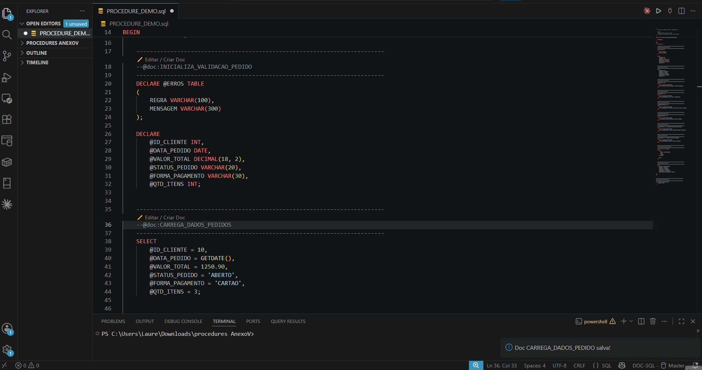
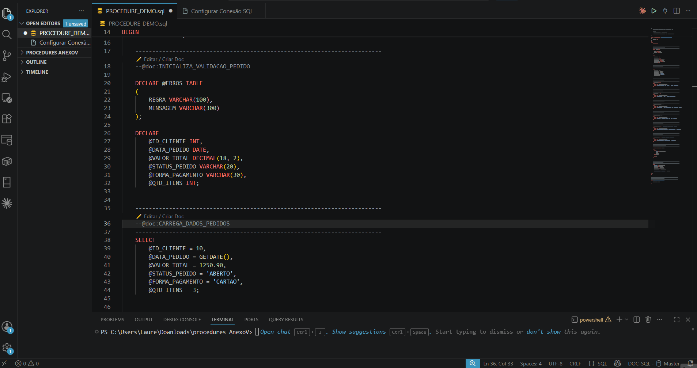

# Documentação SQL Helper

Documente trechos SQL diretamente no VS Code usando comentários `--@doc:` e mantenha as descrições centralizadas em um banco SQL Server.

A extensão foi criada para equipes que trabalham com scripts, procedures e regras SQL complexas, permitindo registrar explicações técnicas e de negócio sem adicionar comentários sensíveis diretamente no arquivo enviado ao cliente.

---

## Demonstração




---

## Recursos

- Documentação inline usando `--@doc:NOME_DO_DOC`
- Visualização da documentação ao passar o mouse sobre o trecho
- Edição e criação da documentação pelo próprio VS Code
- Armazenamento centralizado em SQL Server
- Histórico automático de inclusões, alterações e exclusões
- Suporte a Markdown na descrição
- Suporte a trechos de código SQL dentro da documentação
- Configuração visual da conexão com banco
- Cache por arquivo, banco e documento para melhor desempenho
- Autocomplete para criação rápida do padrão `--@doc:`

---

## Configurando a conexão

Para usar a extensão, primeiro configure a conexão com o SQL Server.

Clique no botão da extensão na **Status Bar** do VS Code, geralmente no **canto inferior direito**, preencha os dados do banco e clique em **Testar**. Após validar a conexão, clique em **Salvar**.



---

## Como funciona

No arquivo SQL, adicione uma marcação no trecho que deseja documentar:

```sql
--@doc:VALIDAR_LOJA
SELECT *
FROM LOJA
WHERE ATIVO = 1;
```

Ao passar o mouse sobre a linha do `--@doc`, a extensão consulta a documentação cadastrada no banco e exibe o conteúdo formatado no hover do VS Code.

---

## Criar uma documentação

Digite a marcação no arquivo SQL:

```sql
--@doc:VALIDAR_CLIENTE
```

A extensão exibirá uma ação acima da linha:

```text
Editar / Criar Doc
```

Clique nessa opção para abrir o editor da documentação.

No editor, escreva a descrição e clique em **Salvar**.

---

## Editar uma documentação existente

Para editar uma documentação já cadastrada:

1. Abra o arquivo SQL.
2. Localize a linha com `--@doc:NOME_DO_DOC`.
3. Clique em **Editar / Criar Doc**.
4. Altere o texto.
5. Clique em **Salvar**.

A alteração será gravada no banco e o histórico será atualizado automaticamente.

---

## Visualização via Hover

Ao passar o mouse sobre o comentário `--@doc`, a extensão exibe:

- Nome do documento
- Descrição formatada
- Autor da inclusão ou alteração
- Data no padrão brasileiro

Exemplo:

```text
VALIDAR_LOJA

Valida se a loja está ativa antes do processamento.

Autor: Nicolas
Atualizado em: 13/05/2026 15:40
```

---

## Autocomplete

A extensão possui autocomplete para facilitar a criação do padrão de documentação.

Ao digitar:

```sql
@
```

ou:

```sql
--@
```

será sugerido o padrão:

```sql
--@doc:NOME
```

Após selecionar a sugestão, basta substituir `NOME` pelo identificador desejado.

Exemplo:

```sql
--@doc:CARREGAR_CLIENTES_ATIVOS
```

---

## Formatos aceitos

A extensão aceita os seguintes formatos:

```sql
--@doc:VALIDAR_LOJA
-- @doc:VALIDAR_LOJA
-- @doc: VALIDAR_LOJA
-- @DOC: VALIDAR_LOJA
```

Quando houver texto após o nome do documento, apenas o primeiro identificador será considerado.

Exemplo:

```sql
--@doc:VALIDAR_LOJA texto extra depois
```

Nesse caso, o identificador utilizado será:

```text
VALIDAR_LOJA
```

---

## Markdown na documentação

A descrição aceita Markdown, permitindo criar textos mais claros e organizados.

### Negrito

```md
**Texto em negrito**
```

### Itálico

```md
*Texto em itálico*
```

### Títulos

```md
### Título da seção
```

### Listas

```md
- Primeiro item
- Segundo item
- Terceiro item
```

### Código inline

```md
Use o campo `STATUS` para validar o registro.
```

### Bloco de código SQL

````md
```sql
SELECT *
FROM CLIENTE
WHERE STATUS = 'ATIVO';
```
